## Writeup

---

**Vehicle Detection Project**

The goals / steps of this project are the following:

* Perform a Histogram of Oriented Gradients (HOG) feature extraction on a labeled training set of images and train a classifier Linear SVM classifier
* Optionally, you can also apply a color transform and append binned color features, as well as histograms of color, to your HOG feature vector. 
* Note: for those first two steps don't forget to normalize your features and randomize a selection for training and testing.
* Implement a sliding-window technique and use your trained classifier to search for vehicles in images.
* Run your pipeline on a video stream (start with the test_video.mp4 and later implement on full project_video.mp4) and create a heat map of recurring detections frame by frame to reject outliers and follow detected vehicles.
* Estimate a bounding box for vehicles detected.

## [Rubric](https://review.udacity.com/#!/rubrics/513/view) Points
### Here I will consider the rubric points individually and describe how I addressed each point in my implementation.  

---
### Writeup / README

#### 1. Provide a Writeup / README that includes all the rubric points and how you addressed each one.  You can submit your writeup as markdown or pdf.  [Here](https://github.com/udacity/CarND-Vehicle-Detection/blob/master/writeup_template.md) is a template writeup for this project you can use as a guide and a starting point.  

You're reading it!

### Histogram of Oriented Gradients (HOG)

#### 1. Explain how (and identify where in your code) you extracted HOG features from the training images. Explain how you settled on your final choice of HOG parameters.

The code for this step is contained in lines 36 through 53 of the file called [vehicle_detection.py](vehicle_detection.py#36).  

I started by reading in all the `vehicle` and `non-vehicle` images.  Here is an example of one of each of the `vehicle` and `non-vehicle` classes:

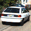
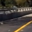

From the experimentation in the HOG lesson in the course, I settled with the `orientations`, `pixels_per_cell`, and `cells_per_block` parameters to be 9, 8, and 2 respectively. These numbers seems to give the best accuracy to the classifier.

For the color_space, I decided to experiment using the classifier directly, that is to train the classifer and comparing it's accuracy accross different color space. Below are the experimentation results.

| Color Space   | Accuracy      | 
|:-------------:|:-------------:| 
| RGB           | 0.9848        | 
| HSV           | 0.9901        |
| LUV           | 0.9944        |
| HLS           | 0.991         |
| YUV           | 0.993         |
| YCrCb         | 0.9901        |

Based on the above, I decided to use the `LUV` color space. Here is an example of HOG of test image using the `LUV` color space and HOG parameters of `orientations=9`, `pixels_per_cell=(8, 8)` and `cells_per_block=(2, 2)`:


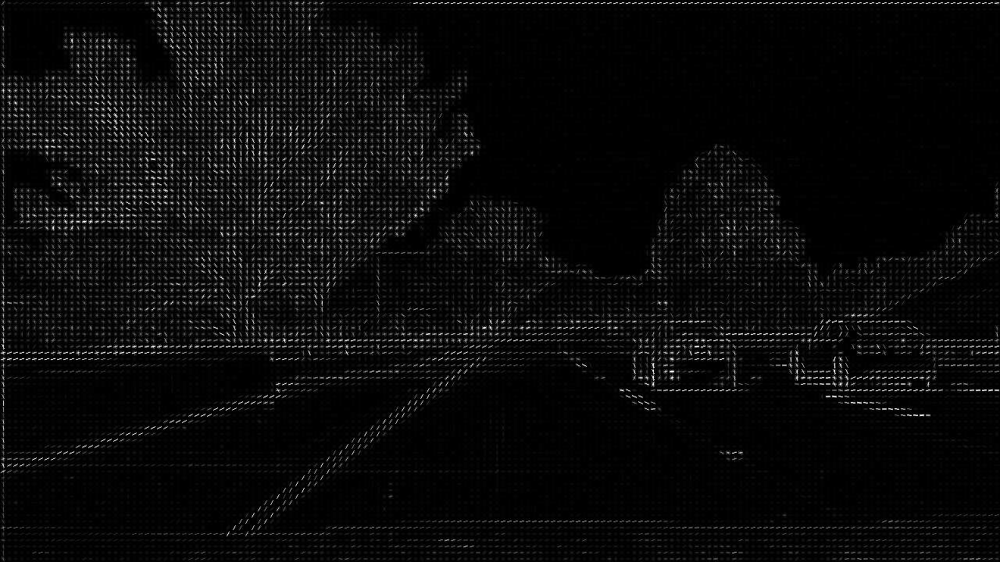
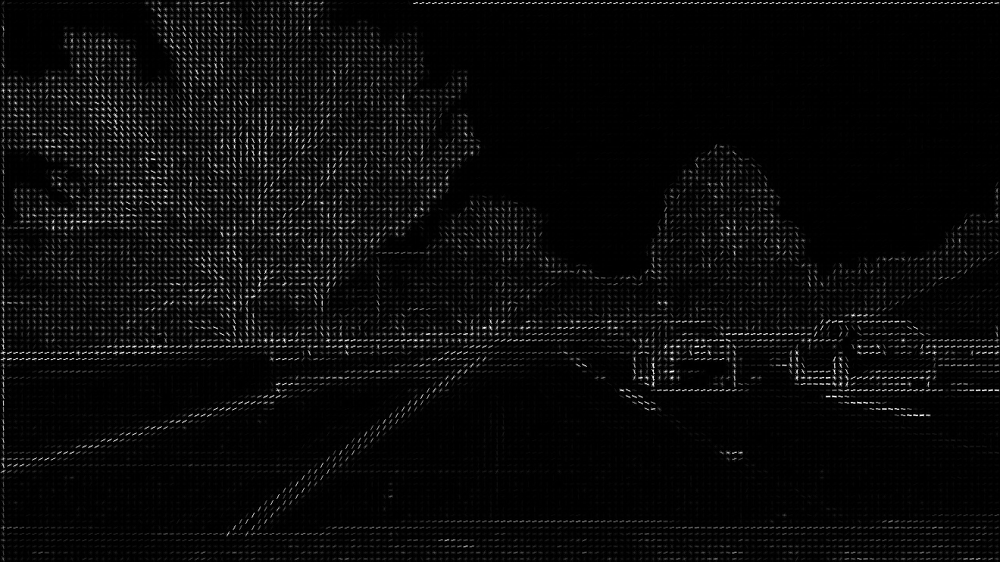


#### 2. Describe how (and identify where in your code) you trained a classifier using your selected HOG features (and color features if you used them).

The code for this is contained in lines 137 through 183 of  [vehicle_detection.py](vehicle_detection.py#137). For the classifier, I decided to use the one recommended in the lesson, which is the Linear SVM. For the features, beside the HOG features, I also included the raw pixel image that's been converted to `LUV` color space and binned spatially into 32x32, and the color histogram with 32 bins.

### Sliding Window Search

#### 1. Describe how (and identify where in your code) you implemented a sliding window search.  How did you decide what scales to search and how much to overlap windows?

The code for this is contained in lines 186 through 266 of  [vehicle_detection.py](vehicle_detection.py#186). I implemented the search with only a single extract of HOG features and then subsampling it to get the window HOG feature. This is to increase the performance of the pipeline.

The search can also be executed with different scales of window sizes. To determine these scales, I experimented quite a lot. First I decided to execute the search only once with scale of 1 and step of 2 pixels. Here is an example image:

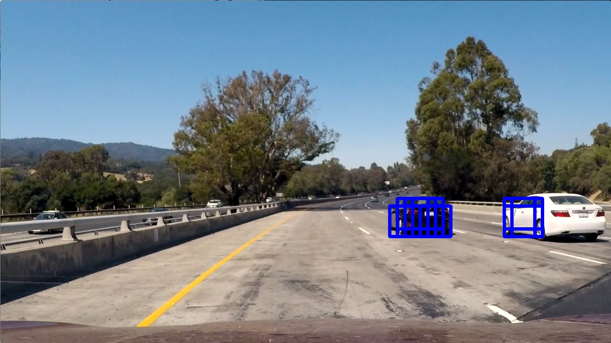

To make the search more robust to other apparent size of cars on the road I then decided to add 3 different scales, that is `0.75`, `1.5`, and `2`, all with the same step of 2 pixels. Here is an example image of detection with the aforementioned search sizes.

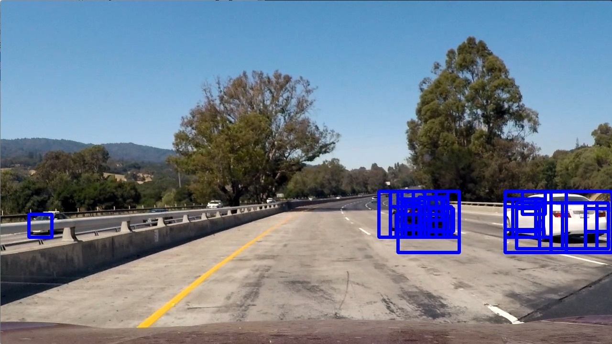

I also tried to set the step pixels to be dependent on the window size with below formula:
```
step_pixel = 8 * scale / 4
```
But it results in detection with many overlapping windows at the exact same place, which is not desirable in the case of big apparent car that need overlapping windows to cover all of it's region. Here is an example:

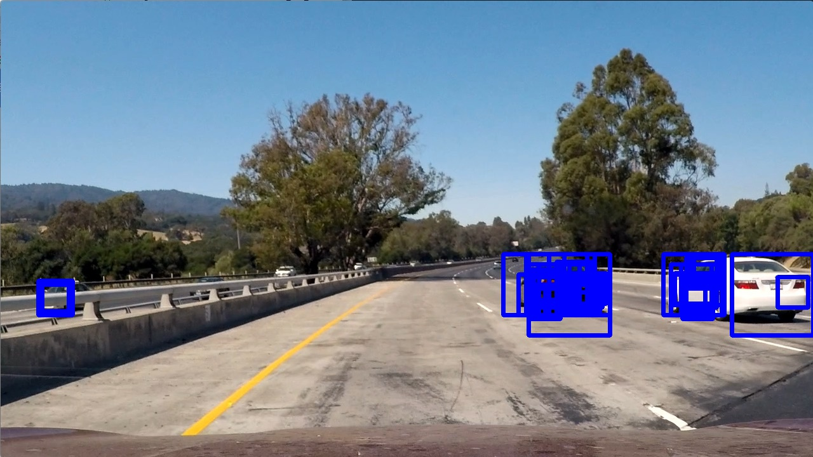

As we can see the rightmost car get 2 sort of region that does not intersect which will results in 2 detection or 1 detection of only one of the region, once heatmap is applied.

#### 2. Show some examples of test images to demonstrate how your pipeline is working.  What did you do to optimize the performance of your classifier?

Ultimately I searched on 4 scales (`0.75`, `1`, `1.5`, `2`) with 2 step_pixel using LUV 3-channel HOG features plus spatially binned color and histograms of color in the feature vector, which provided a nice result.  Here are some example images:

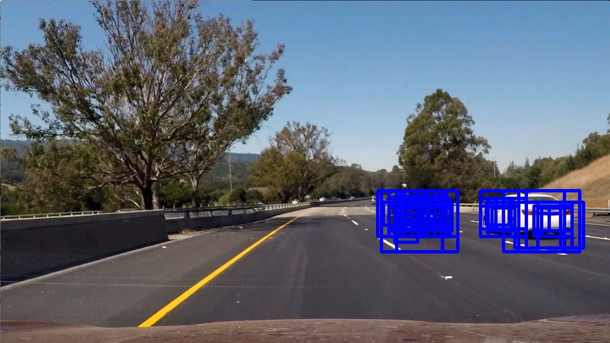
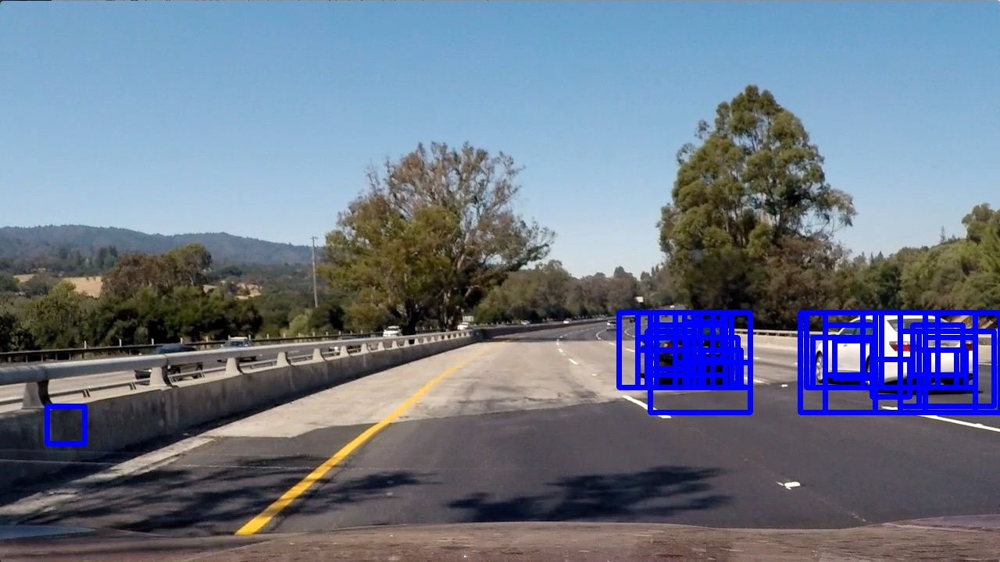
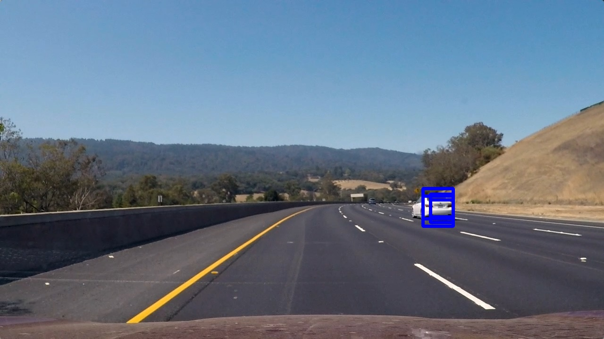

Improving the reliability of the calssifier will be explained in the next sections.

---

### Video Implementation

#### 1. Provide a link to your final video output.  Your pipeline should perform reasonably well on the entire project video (somewhat wobbly or unstable bounding boxes are ok as long as you are identifying the vehicles most of the time with minimal false positives.)
Here's a [link to my video result](./project_video_detected.mp4)


#### 2. Describe how (and identify where in your code) you implemented some kind of filter for false positives and some method for combining overlapping bounding boxes.

I recorded the positions of positive detections in each frame of the video.  From the positive detections I created a heatmap and then thresholded that map to identify vehicle positions.  I then used `scipy.ndimage.measurements.label()` to identify individual blobs in the heatmap.  I then assumed each blob corresponded to a vehicle.  I constructed bounding boxes to cover the area of each blob detected. The code for this is contained in lines 269 through 320 of  [vehicle_detection.py](vehicle_detection.py#269).

Here's an example of the original positive detections, it's corresponding heatmap, and the bounding box result of `scipy.ndimage.measurements.label()`.


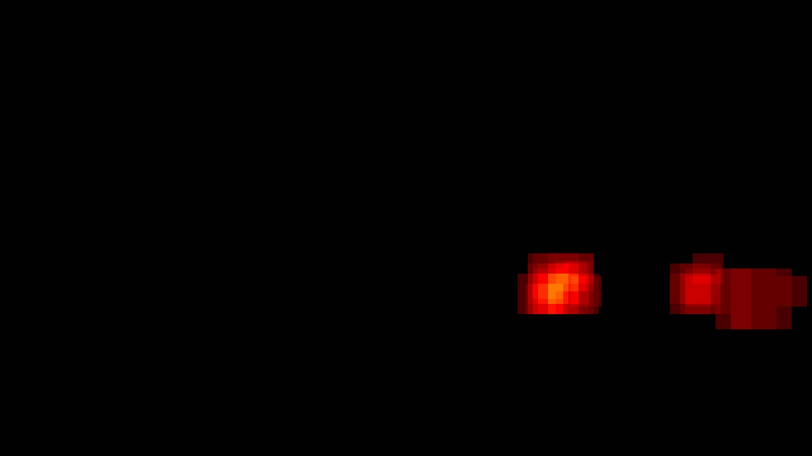
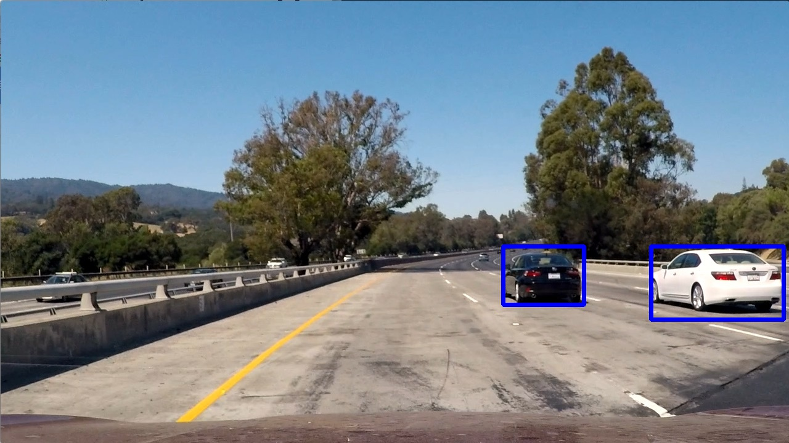

To combat false positives, I decided to record the history of last 2 frame detections. Then, the resulting final bounding boxes from `scipy.ndimage.measurements.label()` of the new frame will be compared to the last 2 detections. A bounding box will be allowed to pass if and only if it intersects with at least one bounding box in each of the last 2 frame detections. Meaning, the new bounding box have to also be detected (at least parts of it) in all 2 previous detection. If it does not, then it will not be outputted in the new frame final detection. The code for this is contained in lines 333 through 349 of  [vehicle_detection.py](vehicle_detection.py#333).

Here are some examples of detections before and after filtering it with the previous 2 frames:

Before:

After:
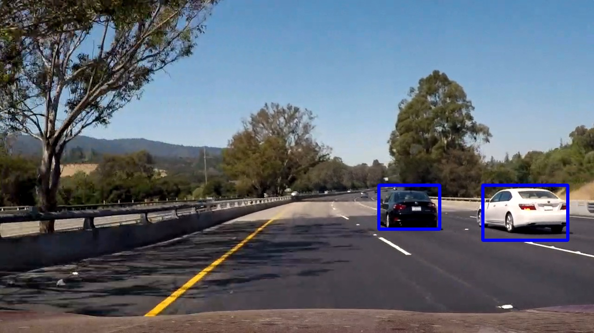

Before:
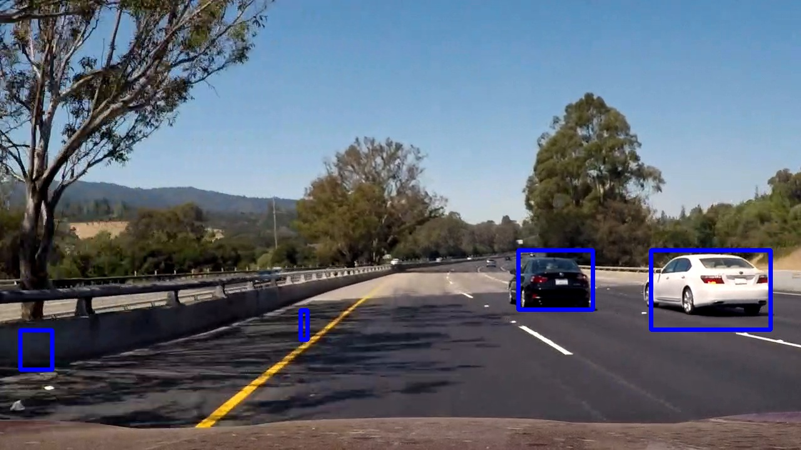
After:
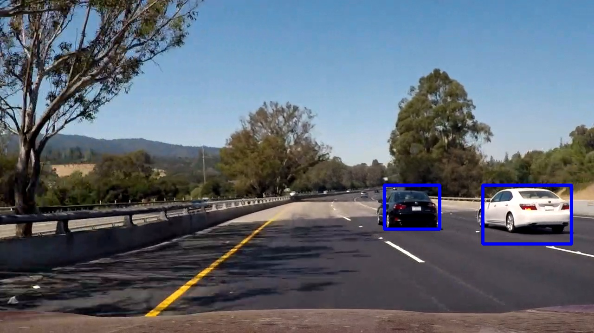

Before:
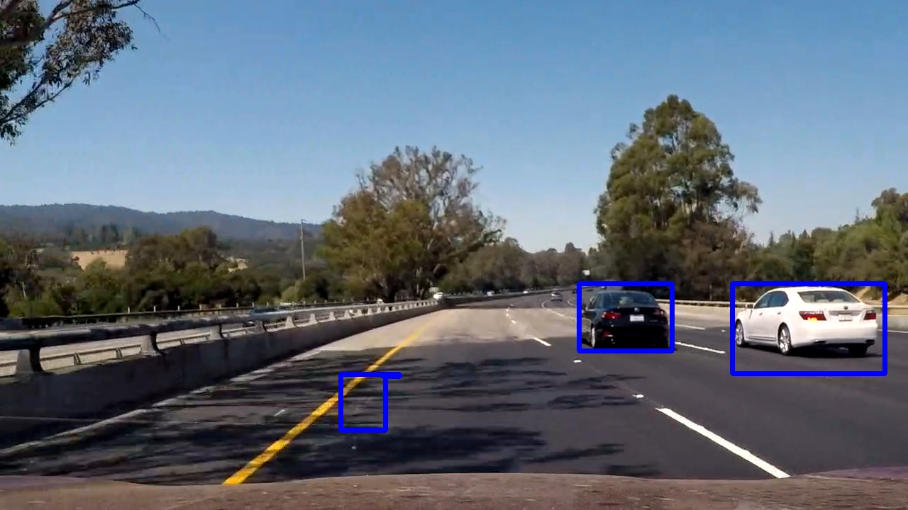
After:
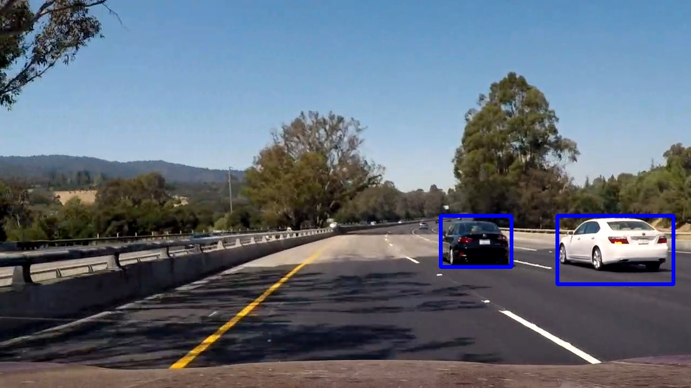

Before:
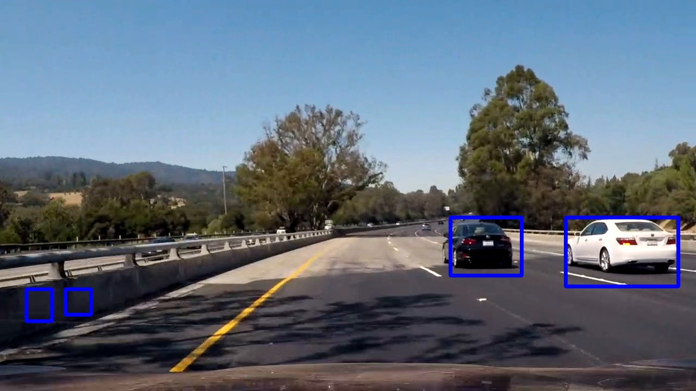
After:


Before:
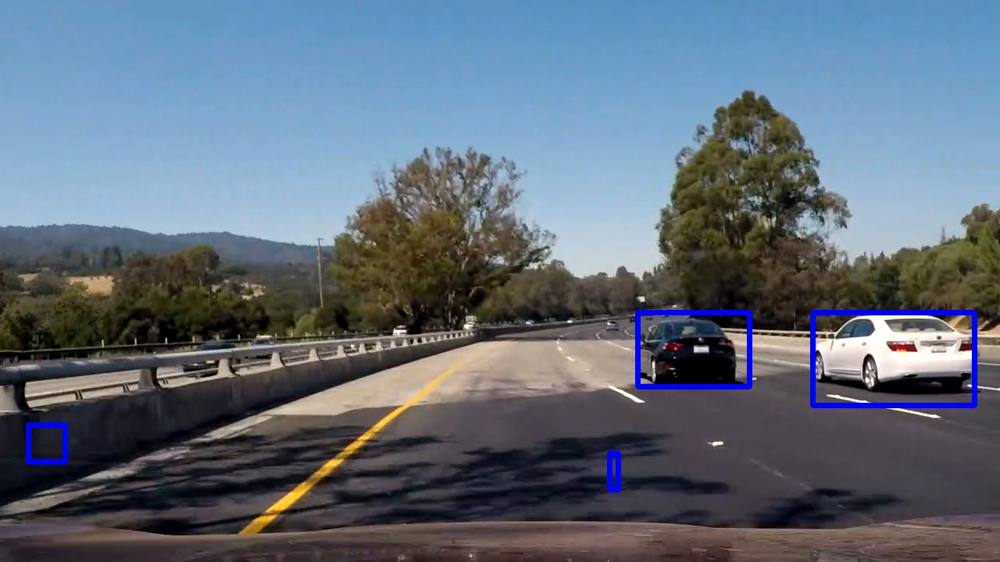
After:


As we can see above the history filter is quite effective in eliminating erroneous detections.

---

### Discussion

#### 1. Briefly discuss any problems / issues you faced in your implementation of this project.  Where will your pipeline likely fail?  What could you do to make it more robust?

Most of the issues I faced are about eliminating the erroneous detections, the false positives. As we can see, even in the final video result, there are a few false positives popping out here and there occasionally. I've tried increasing the number of detection history from 2 frames to 3 frames, but that doesn't really improve the detection much. Other method that I haven't tried, but may possibly lead to better results is to apply heatmap not just in one frame but accross several frames. That way, the heatmap threshold can be set higher, with erroneous detection possibly getting much lower heat than a real positive detection that got detected from several frames.

Also other method that I have tried but doesn't seem to improve the false positives elimination is by hard negative mining, that is to collect sample where the erroneous detections came up and include it in the training data as a negative example. I've tried doing that but instead of decreasing the false positives, it ends up decreasing the quality of the detection of the real car.

Other issue that I found is the state where one car yields multiple detected region. One solution that I can think of is by applying box/gaussian blur to the heatmap before taking the threshold. That way, some area that is weakly detected but is actually surrounded by strong detection will remain in the final detection, which is what the area between 2 detection of the same car usually is.

